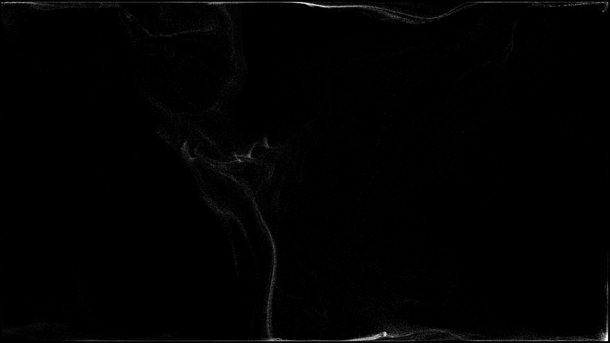

# TV Lab

Приложения и небольшие инструменты для телевизора. Первый проект — **«Поток»**,
офлайн-заставка для Android TV / Google TV с частицами, которые собираются
во фразы и изображения.

## Поток

Свободное движение → сборка образа → удержание → распад → следующий образ.
Текст и изображения настраиваются отдельно от анимации.

- Системная заставка при бездействии через Android `DreamService`.
- Предпросмотр и настройки, доступные с пульта.
- До 12 фраз, по одной на строку. Поддерживается кириллица; текст включается отдельно.
- [100 изображений](docs/assets.md): животные, природа и космос.
- [1000 цитат стоиков](docs/quotes.md): Марк Аврелий, Сенека и Эпиктет, с подписью автора и источником.
- Текст собирается 8 секунд, удерживается 20 секунд и распадается 5 секунд.
- Изображения: 6 секунд сборки, 3,9 секунды удержания и 3 секунды распада.
- [Три шрифта](docs/typography.md), по умолчанию книжный serif.
- Своя картинка через системный выбор файлов заменяет стандартный набор изображений.
- 50 / 100 / 200 тысяч частиц; по умолчанию 200 тысяч, как в визуальном ориентире.
- Случайный порядок при каждом запуске; его можно отключить.
- Ленивая загрузка: в кеше текущая и две следующие сцены.
- Нативная поверхность 3840×2160 и запрос частоты 60 Гц. Фактический FPS зависит от устройства.
- Без звука, сети, рекламы, аналитики и разрешения на доступ ко всему хранилищу.

Визуальный ориентир — [«Взаперти»](https://neuro-slop.ru/lab/vzaperti/).
Движок написан для этого проекта; код, портреты и музыка
сайта сюда не перенесены. Это самостоятельная интерпретация эффекта.

Стандартные изображения — [сгенерированные иллюстрации](docs/assets.md).
Изображения и цитаты чередуются на протяжении всей коллекции; изображения повторяются, пока показываются новые цитаты.



### Установка и запуск

Требуются Android 9.0+ (API 28) и OpenGL ES 3.0. Целевой телевизор —
Philips 65PUS8729/60: установка и системный запуск проверены на Android 12.
[Чёткость, частота кадров и ограничение 1080p-композиции прошивки](docs/validation-0.4.1.md).

1. Установите APK из Releases или соберите его командами ниже.
   При уже настроенном и разрешённом ADB-подключении: `adb install -r particle-dream-debug.apk`.
2. В приложениях телевизора откройте **«Поток · TV Lab»**.
3. Нажмите **«Посмотреть»**. Кнопка «Назад» возвращает в настройки.
4. Отредактируйте фразы и при желании добавьте картинку. Настройки сохраняются
   кнопкой «Сохранить», при запуске предпросмотра и при выходе с экрана.
5. Нажмите **«Выбрать системную заставку»** и выберите «Поток · TV Lab».
   Период бездействия задаётся в настройках системы телевизора.

Некоторые прошивки Google TV показывают только встроенный Ambient mode.
Приложение открывает стандартный экран выбора, но не меняет защищённые
системные настройки. На проверенном Philips компонент удалось назначить через ADB
после разрешения пользователя. На других прошивках выбор требует проверки.
Предпросмотр доступен независимо от этого.

Для импорта нужен системный файловый picker. Если его нет на телевизоре,
приложение сообщит об этом; фразы и встроенные животные продолжат работать.
Файл до 12 МБ уменьшается до размера не более 640×360 и копируется во внутреннее
хранилище приложения. Для узнаваемого образа лучше контрастный силуэт на чёрном
или прозрачном фоне. Полностью пустая/чёрная картинка заменяется стандартными животными.
«Убрать свою картинку» удаляет только копию внутри приложения.

### Сборка

Проверенная связка инструментов: JDK 21, Gradle 8.13, Android Gradle Plugin
8.13.2, Android SDK 36 / build-tools 36.0.0. Исходники используют Java 17;
сторонних runtime-библиотек нет.

Настройте Android SDK через `ANDROID_HOME` либо локальный `local.properties`
с `sdk.dir=/путь/к/sdk`. Этот файл не коммитится.

```sh
./gradlew :particle-dream:assembleDebug :particle-dream:lintDebug
bash tools/test-engine.sh
```

Проверка импорта и стандартных сцен на отдельном эмуляторе:
`bash tools/test-android.sh emulator-5554`. Она устанавливает два тестовых APK
и сбрасывает настройки/свою картинку приложения в эмуляторе; на физическом ТВ
скрипт не запускается.

APK: `apps/particle-dream/build/outputs/apk/debug/particle-dream-debug.apk`.
Это debug-сборка для установки и проверки, не релиз с постоянным ключом подписи.
Ключи подписи в репозитории не хранятся.

Для macOS arm64 есть необязательный изолированный bootstrap. Он скачивает
SDK и Gradle в игнорируемую `.toolchain/` и принимает лицензии SDK только при
явном флаге. Сначала прочитайте [условия Android SDK](https://developer.android.com/studio/terms).

```sh
export JAVA_HOME=/opt/homebrew/opt/openjdk@21/libexec/openjdk.jdk/Contents/Home
bash tools/bootstrap-android.sh --accept-sdk-licenses
./gradlew :particle-dream:assembleDebug :particle-dream:lintDebug
```

## Структура

```text
apps/particle-dream/   Android-приложение «Поток»
docs/                 Архитектура и результаты проверок
tools/                Локальные команды сборки и проверки
```

Новые телевизионные приложения можно добавлять рядом в `apps/`.

## Проверки и ограничения

Проверки 0.4 перечислены в [docs/validation-0.4.md](docs/validation-0.4.md);
предыдущие измерения 4K — в [docs/validation.md](docs/validation.md).
Устройство движка — в [docs/architecture.md](docs/architecture.md); сопоставление
с оригиналом — в [docs/motion-reference.md](docs/motion-reference.md).
Энергосбережение и выключение телевизора остаются под управлением системы.

Gradle Wrapper распространяется с сохранением его
[лицензии](docs/licenses/Gradle-LICENSE.txt) и [NOTICE](docs/licenses/Gradle-NOTICE.txt).

## Версия для Mac

Нативная заставка на Swift / Metal с общим каталогом 100 изображений и 1000 цитат.
[Сборка, установка и проверка macOS-версии](docs/macos.md).
