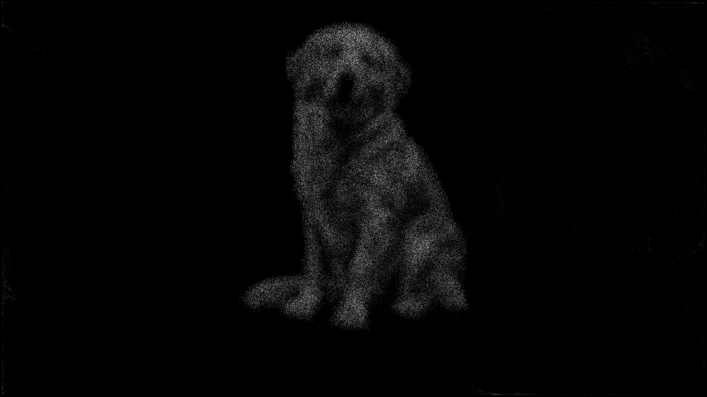
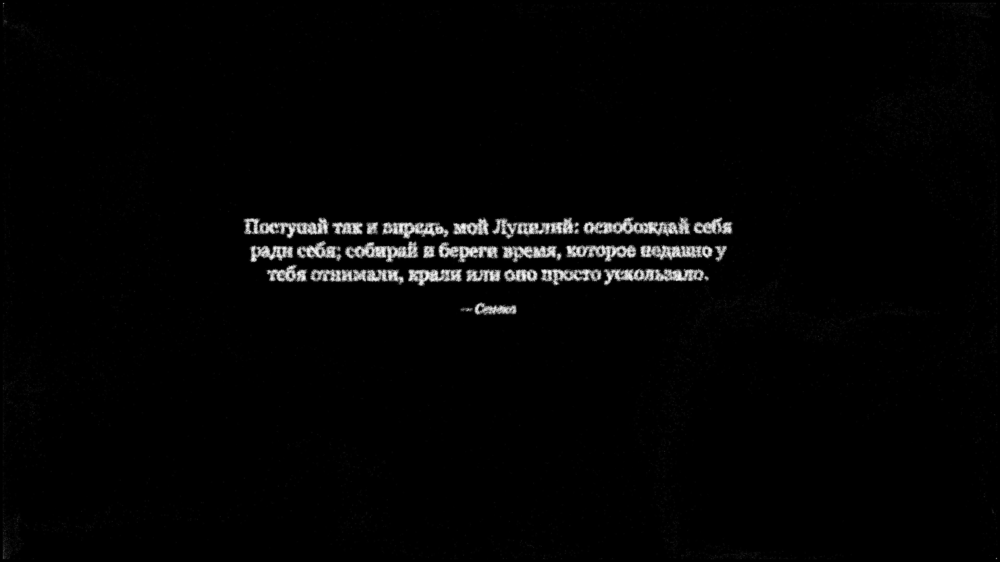

# «Поток» для macOS

Нативная заставка на Swift / Metal. Общие с Android 100 изображений и 1000 цитат
копируются в bundle при сборке; сеть не нужна. Движение воспроизводит уравнения
Android: восемь вихрей, поле 65×49, индивидуальный захват, распад и отражения.

Текст: Georgia с кириллицей, курсивная подпись автора. Удержание текста 20 секунд,
сборка 8 и распад 5; изображения 6 / 3,9 / 3 секунды. Между сценами свободный поток.
Изображения и цитаты чередуются; порядок перемешивается при запуске. В памяти
остаются три облака целей и максимум одно подготавливаемое в фоне. Рендерится
200 тысяч частиц в родном разрешении экрана с целью 60 FPS.

## Сборка и установка

Нужны уже установленные Command Line Tools со Swift и SDK macOS. Сторонних
зависимостей нет. Metal компилируется локально при запуске из включённого исходника;
отдельный Metal compiler из полного Xcode не требуется.

```sh
/bin/bash tools/build-macos.sh
/bin/bash tools/install-macos.sh
open 'apps/macos-flow/build/Flow Preview.app'
```

Сборка создаёт `apps/macos-flow/build/Flow.saver` и `Flow Preview.app`.
Установщик копирует заставку в `~/Library/Screen Savers/Flow.saver` и отказывается
перезаписывать существующую установку. Выбор заставки и интервала бездействия:
**Системные настройки → Заставка / Экран блокировки**. Предпросмотр — обычное окно;
полноэкранный режим доступен зелёной кнопкой окна.

Архитектура бинарника соответствует компьютеру сборки; проверена arm64 на M4 Pro,
macOS 15.1, SDK 15.2. Минимальная заявленная версия macOS 13 не проверена отдельно.
Подпись локальная ad hoc: эта сборка предназначена для своего Mac и не нотарифицирована
для массового распространения. Android-приложение не меняется.

## Проверки

```sh
JAVA_HOME=/path/to/jdk /bin/bash tools/test-macos.sh
```

Проверяются все 100 изображений и 1000 цитат, ограничение кеша и закрытие загрузчика,
расчёт Metal против существующего Java CPU-движка, 4K-отрисовка и загрузка `.saver`
системным API `Bundle` с вызовами start/stop. Результаты опыта —
[validation-macos.md](validation-macos.md).




## Отличия первого Mac-выпуска

Пока используется стандартный полный каталог без UI импорта собственной картинки,
личных фраз и выбора количества частиц. Georgia заменяет Android serif. Физическая
ширина поля подстраивается под соотношение сторон Mac; на 16:9 уравнения совпадают.
Реальные траектории не побитово одинаковы из-за случайного порядка и различий
численной точности Java/OpenGL/Metal. Многомониторный режим и длительная работа
на батарее отдельно не проверены.

API: [ScreenSaverView](https://developer.apple.com/documentation/screensaver/screensaverview),
[CAMetalLayer](https://developer.apple.com/documentation/quartzcore/cametallayer).
