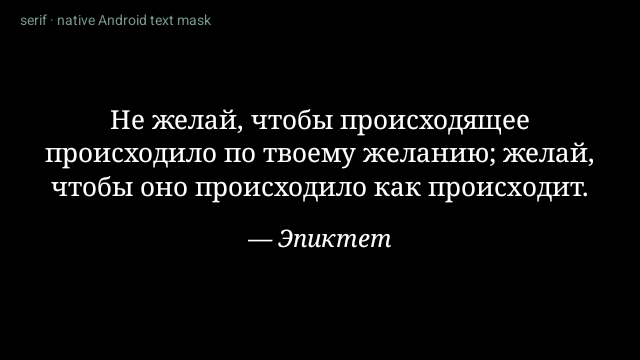
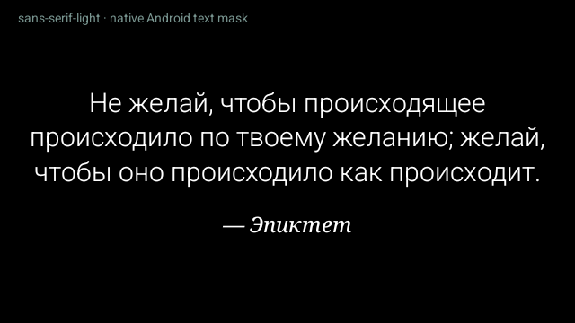
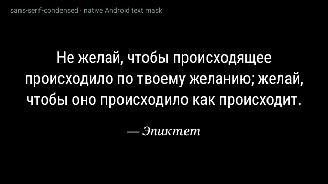
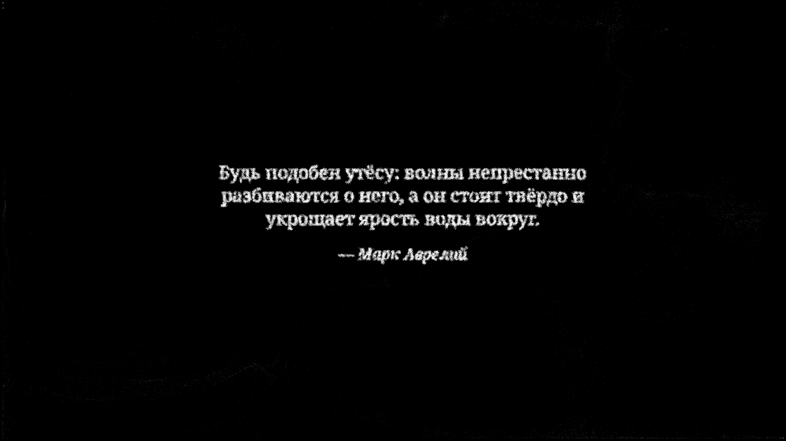

# Шрифты для цитат

Сравнены три штатных семейства Android с кириллицей на одном фрагменте
Эпиктета, с одинаковым переносом по словам и подписью автора. Изображения ниже
получены из того же Android Canvas, который приложение превращает в облако
точек; это сравнение текстовых масок, не три отдельных FPS-теста.

| Вариант | Наблюдение |
|---|---|
| `serif` (Noto Serif в Android TV 14 эмуляторе) | Книжный рисунок, хорошо различимые штрихи. Выбран по умолчанию. |
| `sans-serif-light` | Воздушный и самый тонкий; для частиц предпочли более выраженные штрихи serif. |
| `sans-serif-condensed` | Компактный, удобен для длинных фраз; характер ближе к интерфейсному тексту. |

Подпись автора — курсивный serif. Все три варианта доступны в настройках.
Используются системные шрифты: на другой прошивке конкретный файл семейства
может отличаться. Дополнительные шрифты не устанавливались.

Цитаты собираются за 8 секунд, удерживаются 20 секунд и распадаются за 5 секунд.
Переносы делаются по словам; размер уменьшается для длинных текстов. Для чтения
уменьшено локальное дрожание частиц в буквах, сохранилось плавное движение
всего блока.

Выбранный serif также просмотрен на настоящей сцене из частиц в4K:

