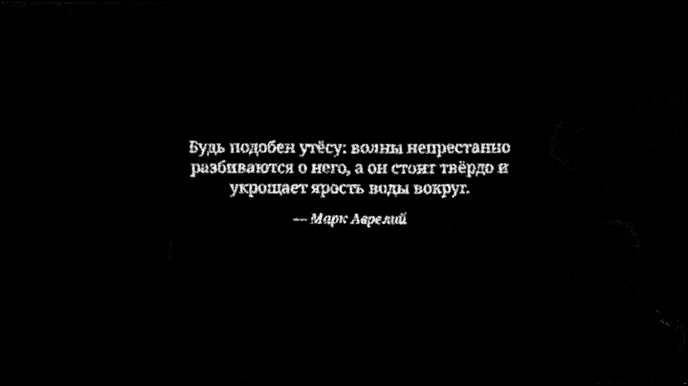

# Проверка версии 0.3.0

2026-09-06, Android TV 14 эмулятор на Mac M4 Pro, поверхность 3840×2160.
Физический Philips не использовался.

- Сборка debug APK и Android test APK — BUILD SUCCESSFUL.
- Android Lint — 0 ошибок, 2 предупреждения (обновление Gradle и конструктор
  программно создаваемого View для XML layout editor).
- Host-тест — PASS: детерминированный поток, удержание изображения +3 секунды,
  отдельное чтение текста20 секунд, медленные переходы,60 секунд моделирования,
  отскоки и защита от скачка времени после паузы.
- Android-тест — PASS:100 цитат только Марка Аврелия/Сенеки/Эпиктета,12 различных
  изображений, непустые облака всех112 уникальных сцен, подписи и источники,
  перенос по словам, ограничение ширины, импорт с EXIF и сохранностью оригинала,
  восстановление стандартного набора после удаления своей картинки.
- Очередь200 сцен чередует100 цитат с изображениями, повторно используя те же
  12 облаков изображений. При прежней предварительной загрузке они занимали 37 МиБ.
  Теперь проверен ограниченный кеш, реальные сцены готовятся по мере необходимости.
- GPU/CPU сравнение — PASS:256 частиц,900 шагов, включая20-секундное чтение
  и распад. Проверяются синхронизированные блоки по60 шагов, допуск0.0002;
  максимальная ошибка0.0000028014. Свободный40.5-секундный прогон прежде дал
  накопленное расхождение0.003915; оно сохранено как наблюдение чувствительности
  траекторий к floating-point различиям, а не скрыто увеличением допуска.
- Проверены три текстовые маски системных шрифтов на Android. Выбран serif;
  отдельно просмотрен настоящий4K кадр цитаты из частиц с подписью автора.
-100 исходных английских фрагментов найдены в точных разделах публичных
  первоисточников. Проверены схема, состав40/35/25, отсутствие точных дублей,
  длина33–181 символ. Приложение содержит тот же проверенный набор;
  изменён только порядок начальных фраз.

Новый FPS-бенчмарк не проводился: эта версия меняет контент и интервалы,
сохраняя4K GPU pipeline. Предыдущие результаты и ограничения приведены
в [validation.md](validation.md). Полная филологическая экспертиза переводов
не проводилась; русский текст сверялся с указанными английскими изданиями,
не непосредственно с греческим и латинским.

## Стресс-тест ленивой загрузки

`SceneCacheTest` запущен с `-Xmx64m`. Синтетический каталог имитировал размеры
облаков 100 изображений и 1000 цитат, с 2000 позициями очереди. Это проверка
загрузчика и памяти, не новая подборка контента и не GPU FPS-бенчмарк.

- При создании каталога не подготовлено ни одного облака.
- Пиковый объём удерживаемых облаков: 2 359 296 байт (2,25 МиБ).
- Выполнено 2002 материализации при полном проходе и предзагрузке начала следующего круга.
- Пройдены задержка загрузчика без блокировки `ParticleEngine.advance`, сохранение
  активных целей/метаданных, пропуск ошибки, отбрасывание устаревшего результата,
  прерывание при закрытии и перезапуск текущей сцены при потере EGL-контекста.
- Android-тест отдельно проверил реальные рецепты всех 12 изображений и 100 цитат,
  предзагрузку первой группы и предел кеша не более 3 МиБ.

Предел относится только к кешу целей. Полная память процесса и пиковая память
нативного декодирования на Philips пока не измерены. Содержимое не расширялось
до 100 изображений и 1000 цитат.

После оптимизации на открытом Android TV эмуляторе отдельно просмотрен переход
из изображения в цитату через ленивый кеш. Поверхность4K появилась через3,73с
после команды запуска (значение включает задержку опроса и не является
сравнительным бенчмарком). Цитата и подпись отобразились корректно.

