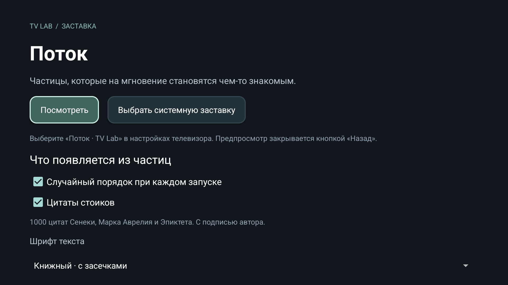
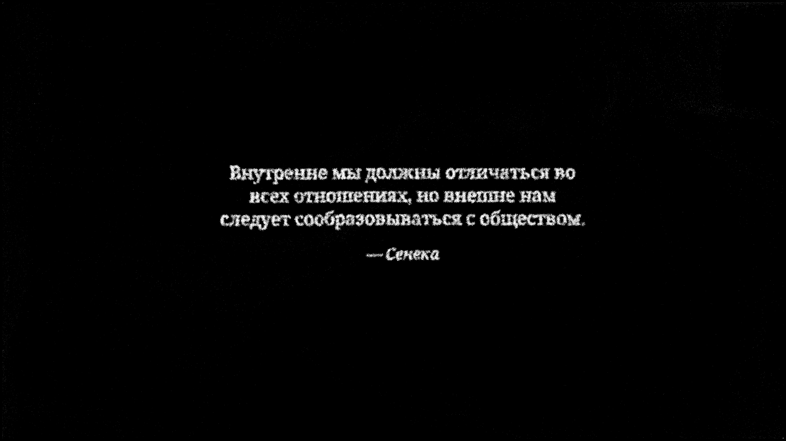

# Проверка версии 0.4.0

Дата: 2026-09-06. Это проверка фактического содержимого APK, не только
синтетического каталога загрузчика.

## Содержимое

- Ровно 100 изображений: 47 животных, 25 природных, 28 космических.
- Все 100 записей имеют разные id и области атласов; соответствующие файлы существуют.
- Android ImageInventory декодировал все 100 и получил разные непустые облака.
- Ровно 1000 цитат: 350 Марка Аврелия, 400 Сенеки, 250 Эпиктета.
- Все 100 прежних объектов сохранены, добавлены 900 новых.
- `python3 tools/check-quote-library.py` — PASS: 1000 фрагментов в точных
  разделах первоисточников, схема, даты, авторы, длины и отсутствие точных/
  подстрочных дублей. Архив разделов находится в docs/quote-evidence и не входит в APK.
- Длина перевода: 33–249 символов. Русский текст — собственный перевод с
  указанных английских изданий. Прямая сверка с греческим/латинским не проводилась.

## Приложение

- Сборка debug APK и test APK — BUILD SUCCESSFUL.
- Android Lint — 0 ошибок, 2 прежних предупреждения: новая версия Gradle
  и конструктор программно создаваемого ParticleView для XML layout editor.
- Host-тесты — PASS: длительности, физика, ленивый кеш, задержки, отмена,
  ошибки и восстановление контекста. Стресс-тест выполнен с -Xmx64m.
- Полный Android-тест — PASS: реальные 100 изображений и 1000 цитат,
  подписи/источники, переносы, все 1100 разных рецептов сцен, импорт/EXIF,
  восстановление библиотеки и ограниченный кеш.
- GPU/CPU — PASS, 256 частиц, 900 шагов, синхронизированные блоки по 60 шагов;
  максимальная разница 0.0000028014 при допуске 0.0002.
- Случайный порядок включён по умолчанию и отключается в настройках.
- Проверка подписи APK выполнена apksigner.

Рендеринг остаётся 4K на GPU. Новый FPS-бенчмарк не проводился; результаты
прошлых измерений нельзя считать гарантией для Philips. Физический телевизор
в этой проверке не использовался. Выпуск — предварительная debug-сборка.

SHA256 APK: `c338ef8be281920ca44b86df398aab1a096ad59c8aff79bc19ee76ef9acfe5ad`.

После сборки отдельно запущен предпросмотр полного каталога в эмуляторе.
Наблюдались новый случайный порядок и цитата из расширенного набора в4K.

